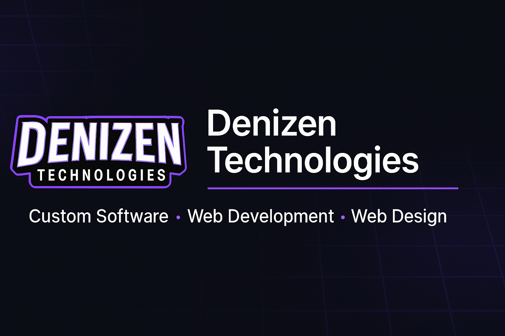

<!-- Banner -->

  

# **Denizen Technologies – Official Website**

This repository contains the complete source code for the **Denizen Technologies** website — a modern, dark-themed, animated one-page site showcasing our services in **Custom Software**, **Web Development**, and **Web Design**.

The site is built with clean HTML, CSS, and lightweight JavaScript to provide a smooth, fast, and professional experience.

---

## 🚀 **Features**

### **💻 Modern Dark UI**
- Tech-inspired gradients  
- Neon purple accent lighting  
- Subtle animated grid background  
- Highlighted section navigation with active state tracking

### **📄 One-Page Layout**
Includes:
- Hero Section  
- Services  
- About  
- Why Choose Us  
- Process  
- Projects (Coming Soon)  
- Contact  
- Footer  

### **🎨 Custom Hero Dashboard Mockup**
Designed entirely with HTML/CSS — no images required.

### **📱 Fully Responsive**
Optimized for desktop, tablet, and mobile.

### **🧩 Smooth Animations**
- Scroll reveal effects  
- Sticky blurred-glass navbar  
- Active section highlighting  

### **📬 Contact Form Integration**
Form submissions handled via **Formspree**.  

### **🔖 SEO + Social Sharing Optimized**
- Meta title/description  
- Canonical URL  
- Open Graph tags (Discord, Facebook, LinkedIn)  
- Twitter Card  
- `og-image.png`

### **📱 PWA-Ready**
Includes:
- `manifest.webmanifest`  
- App icons in multiple sizes  
- Favicon `.ico`

---

## 📂 **Project Structure**

